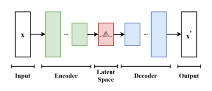

# Variational Auto Encoder (VAE)

## Purpose:
This repository is an implementionation of the `Auto-Encoding Variational Bayes by Diederik P. Kingma and Max Welling` paper from the scratch using `PyTorch` to get a good understanding on the concepts used in `Variational Auto Encoder`. The MNIST dataset is used in the code for understanding the concepts.

## Architecture

## Scripts:
- `model.py`: `Encoder`, `Decoder` layers are defined and implemented for the `VAE`
- `train.py`: To train the VAE model from scratch

## Purpose of VAE:

Let's understand the key concepts involved in the `VAE` along with the code.

A `VAE` is a type of generative model that consists of an `Encoder` network and `Decoder` network, similar to traditional Auto Encoders. The objective of the VAEs is information reconstruction and generation. For the given dataset sampled from unknown distribution we can conditionally generate new data with the same distribution.

## Encoder Architecture:

- The `Encoder` is responsibile to convert the Input Image to the `Latent Space Distribution`
- The `Encoder` network in `VAE` maps the input data to a probability distribution in the `latent space`, represented by a `mean` and `variance`.
- In our example code we have used `(4, 784)` -> This represents the `batch_size` as `4` and the `input image` dimension as `28*28 = 784`.
- A `Linear` layer is constructed with the shape of (`input_image_dimension`, `hidden_dimension`). Here the `hidden_dimension` is the dimension of the `hidden layers` present in the `Encoder` block.
- Two more `Linear` layers are used to calculate the `mean` and `variance`
- These parameters `mean` and `standard deviation` are returned from the `Encoder` to the `Decoder`

## Latent Space Distribution:

It is a probability distribution that represents the possible values or states that a hidden or latent variable can take on. This hidden variable captures the important information about the data in a compressed and structured form.

### Example:

Suppose the `VAE` model is trained to generate image of cats. In this case, the `latent distribution` is like a set of instructions or rules for creating different aspects of a cat, such as it's shape, fur color, eye size etc. These instructions are probablistic, they won't give  a single fixed answer, rather a range of possibilities for each aspect.

The `Latent distribution` is a Gaussian distribution with two main parameters:

- `Mean (μ)`: This represents the center or average value of the distribution.
- `Variance (σ^2)`: This represents how spread out or uncertain the values are around the mean

When the sampling is done from the Gaussian Latent distribution, it is essentially generating a point in a multidimensional space, where each dimension corresponds to a different aspect of the data. Each sample is a set of values that define how the cat should look, along with this the degree of randomness is triggered by `variance`.

During training, the VAE learns to adjust the `mean` and `variance` of this latent distribution based on the input data.

## Reparametrization:

A key technique used in VAE to make the training process smoother and enable the model to learn the latent distribution effectively.

### What is the problem with the traditional sampling in VAE?

In Traditional sampling, we directly sample from the Gaussian distribution by generating random numbers and scaling them by the learned `mean` and `standard deviation`

            `mean + random_number * standard_deviation`

This can be challenging to backpropogate gradients while training the model. To overcome this problem, `Reparametrization` technique is applied.

### Reparametrization technique:

Instead of directly sampling from the distribution, reparametrization separates the randomness from the distribution. A random number is from a Standard Gaussian distribution, and then this sampled number is used to adjust the parameters mean and standard deviation of the latent distirbution.

Steps Involved:

- A random number is sampled from a standard Gaussian distribution (`mean = 0`, `standard deviation = 1`). This step introduces randomness.
- Then, this sampled random number is used to adjust the mean and standard deviation of the latent distribution.
- The result is a point in the latent space that is sampled in a way that allows for gradient computations during training. This makes it possible to update the model's parameters through backpropagation.

            epsilon = torch.randn_like(sigma)
            z_reparametrized = mu + sigma*epsilon

From the above code, 
    - `epsilon` is the sampled random number
    - `sigma` is the variance
    - `mu` is the mean
    - `z_reparameterization` the result of the reparametrization technique.

## Decoder Architecture:

- The `Decoder` is responsible to reconstruct the `input` from the `latent distribution`
- In our example code we have used `(4, 784)` -> This represents the `batch_size` as `4` and the `input image` dimension as `28*28 = 784`.

## Loss Functions

In VAE, we have two loss functions,

- Binary Cross Entropy loss function
- Kullback - Divergence Loss Function

### Binary Cross Entropy (BCE)

The `BCE` loss is used to measure the dissimilairty between the reconstructed data and the original input. `BCE` loss is appropritate in case of `VAE`, as it involves in the reconstruction task.

            loss_fn = nn.BCELoss(reduction="sum")
            reconstructed_loss = loss_fn(x_reconstructed, x) #To reconstruct the image

From the above code,

- For each feature (dimension) in the input data, `BCE` loss calculates the cross-entropy between the predicted value and the actual value. It penalizes the model more, when the predcited probability is far from the actual value.
- Then, the `BCE` loss is then summed across all features.
- The overall loss `reconstructed_loss` is computed as the sum of the `BCE` losses for all the features, proving a single scalar value to minimize during the training

### Kullback - Divergence (KL Divergence)

In `VAE`, to encourage the learned `latent distribution` to be closed to a desired distribution, the KL Divergence loss is used. It measures how much the learned distribution differs from the desired distribution. 

The formula for the KL Divergence between two Gaussian distribution is defined by

            KL Divergence Loss = 0.5 * sum(sigma + mu^2 - log(sigma) - 1)

- `mu` is the means of the learned latent distribution
- `sigma` is the variance of the learned latent distribution.
- `sum` The sum is taken over all dimensions of the latent space.

### VAE Loss = BCE Loss + KL Divergence Loss:

The overall loss used for training a `VAE` is the sum of the `KL Divergence` Loss and `BCE` Loss (Reconstruction Loss). The KL Divergence loss encourages the latent space to have a specific structure, while the reconstruction loss ensures that the model can accurately reconstruct the input data.